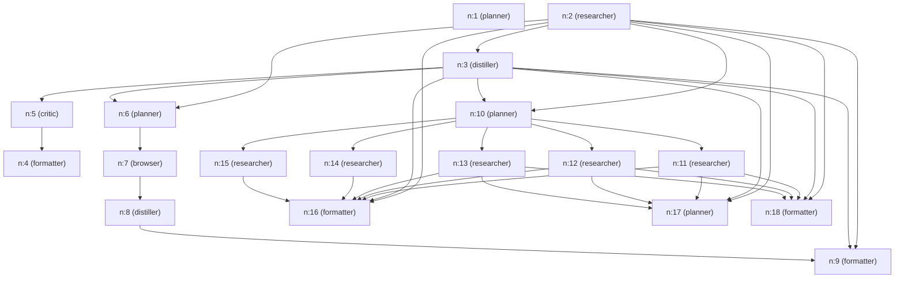

# S9 Browser-Capable Agent Replay Report
**Session ID**: `s8-c28b134d`

---

## 1. Original User Goal
> Compare 5 CNC/VMC training institutes in Bangalore. For each, retrieve the institute name, location, courses offered, contact details, and fee structure if available. Produce a structured comparison table.

---

## 2. Planner DAG
Below is the execution flow generated by the Planner:



---

## 3. Browser Paths and 4. Actions Taken
Here are the details of the browser-based executions during this run:

No browser executions occurred.

---

## 5. Page-State Logs
The page-state details (including accessibility tree logs or coordinate annotations) are stored in the local session folders:
- **Screenshots & Legends**: `state/sessions/s8-c28b134d/browser/`

---

## 6. Extracted Data
The following data was extracted and structured by the `distiller` node:

```json
{
  "institutes": [
    {
      "name": "Rite CNC CAD & CAM Training Centre",
      "location": "Bangalore"
    },
    {
      "name": "CADPOINT Authorized Training Centre",
      "location": "Bangalore"
    },
    {
      "name": "Mass Education Academy",
      "location": "Bangalore"
    },
    {
      "name": "Upskill Labs",
      "location": "Bangalore"
    },
    {
      "name": "Techsys",
      "location": "Bangalore"
    }
  ],
  "courses": "CNC Machining, VMC programming, and CAD/CAM software (e.g., Mastercam)"
}
```

---

## 7. Final Comparison Table
Here is the final output comparison table compiled by the `formatter` node:

Here is a structured comparison of 5 CNC/VMC training institutes in Bangalore based on available information:

| Institute Name                  | Location               | Courses Offered                                   | Contact Details                 | Fee Structure                  |
|--------------------------------|------------------------|-------------------------------------------------|--------------------------------|-------------------------------|
| Rite CNC CAD & CAM Training Centre | Peenya Industrial Area, Bangalore | CNC Machining, VMC Programming, CAD/CAM (e.g., Mastercam) | No F11-F12, 1st Floor, B Block, Kushal Garden Arcade, near Systems Bus Stop, Peenya Industrial Area, Bangalore - 560058 | Not publicly listed; fees available on request via direct contact |
| CADPOINT Authorized Training Centre | Bangalore (multiple centers) | CNC Machining, VMC Programming, CAD/CAM, other technical courses | Specific Bangalore contact details not consolidated publicly; generally requires direct inquiry | Not publicly available; fees vary per course and require direct inquiry |
| Mass Education Academy          | Vijayanagar, Bangalore | CNC Machining, CAD/CAM, Solidworks, Catia, Revit, Tally, GST, SAP, HR Management, and other software courses | Phone: 9611334798               | Not publicly available; contact academy for details |
| Upskill Labs                   | Bangalore              | CNC Machining, VMC Programming, CAD/CAM software training | Contact details not publicly available | Fee details not publicly available; direct contact recommended |
| Techsys                       | Bangalore              | CNC Machining, VMC Programming, CAD/CAM software training | Contact details not publicly available | Fee details not publicly available; direct contact recommended |

Summary: All five institutes offer CNC and VMC programming training along with CAD/CAM software courses such as Mastercam. Detailed fee structures and direct contact information are mostly not publicly disclosed and require contacting the institutes directly for accurate and current information.

---

## 8. Turn Count and Cost Summary
Below is the cost ledger breakdown retrieved directly from the LLM Gateway V9 pricing register:

```json
{
  "critic": [
    {
      "agent": "critic",
      "provider": "groq",
      "calls": 1,
      "in_tok": 1307,
      "out_tok": 40,
      "total_latency_ms": 315,
      "total_retries": 0,
      "ok": 1,
      "errors": 0,
      "dollars": 0.000226
    }
  ],
  "distiller": [
    {
      "agent": "distiller",
      "provider": "gemini",
      "calls": 1,
      "in_tok": 1528,
      "out_tok": 210,
      "total_latency_ms": 1367,
      "total_retries": 0,
      "ok": 1,
      "errors": 0,
      "dollars": 0.0
    }
  ],
  "formatter": [
    {
      "agent": "formatter",
      "provider": "gemini",
      "calls": 2,
      "in_tok": 0,
      "out_tok": 0,
      "total_latency_ms": 656,
      "total_retries": 0,
      "ok": 0,
      "errors": 2,
      "dollars": 0.0
    },
    {
      "agent": "formatter",
      "provider": "github",
      "calls": 2,
      "in_tok": 4226,
      "out_tok": 801,
      "total_latency_ms": 13850,
      "total_retries": 0,
      "ok": 2,
      "errors": 0,
      "dollars": 0.0
    },
    {
      "agent": "formatter",
      "provider": "groq",
      "calls": 3,
      "in_tok": 6221,
      "out_tok": 1070,
      "total_latency_ms": 3022,
      "total_retries": 0,
      "ok": 3,
      "errors": 0,
      "dollars": 0.001736
    }
  ],
  "planner": [
    {
      "agent": "planner",
      "provider": "gemini",
      "calls": 4,
      "in_tok": 14675,
      "out_tok": 1179,
      "total_latency_ms": 6846,
      "total_retries": 0,
      "ok": 4,
      "errors": 0,
      "dollars": 0.0
    }
  ],
  "researcher": [
    {
      "agent": "researcher",
      "provider": "gemini",
      "calls": 17,
      "in_tok": 41116,
      "out_tok": 1779,
      "total_latency_ms": 18579,
      "total_retries": 0,
      "ok": 17,
      "errors": 0,
      "dollars": 0.0
    }
  ]
}
```
